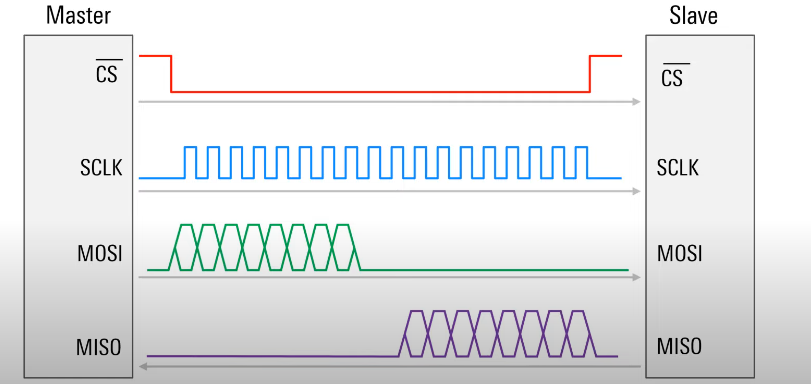

# 🔄 SPI (Serial Peripheral Interface)

## 📝 Tổng quan

SPI (Serial Peripheral Interface) là một chuẩn giao tiếp nối tiếp đồng bộ, thường được sử dụng để truyền dữ liệu giữa vi điều khiển và các thiết bị ngoại vi như cảm biến, bộ nhớ, màn hình, v.v. SPI sử dụng bốn đường tín hiệu chính:

- 📤 **MOSI (Master Out Slave In)**: Dữ liệu từ Master đến Slave
- 📥 **MISO (Master In Slave Out)**: Dữ liệu từ Slave đến Master
- ⏰ **SCK (Serial Clock)**: Xung nhịp do Master tạo ra
- 🎯 **SS/CS (Slave Select/Chip Select)**: Chọn thiết bị Slave

> SPI có tốc độ truyền dữ liệu cao, cấu trúc đơn giản và dễ triển khai trong các ứng dụng nhúng.

---

## 🛠️ Hướng dẫn giao tiếp SPI

### 1. 📌 Giới thiệu SPI
SPI (Serial Peripheral Interface) là giao tiếp nối tiếp đồng bộ, thường dùng để kết nối vi điều khiển với các ngoại vi như cảm biến, bộ nhớ, màn hình, v.v.

### 2. 🔌 Các chân tín hiệu SPI
- 📤 **MOSI (Master Out Slave In):** Truyền dữ liệu từ Master đến Slave
- 📥 **MISO (Master In Slave Out):** Truyền dữ liệu từ Slave đến Master
- ⏰ **SCK (Serial Clock):** Xung nhịp do Master tạo ra
- 🎯 **SS/CS (Slave Select/Chip Select):** Chọn thiết bị Slave

### 5. ⚠️ Lưu ý khi sử dụng SPI
- ⚡ Đảm bảo cấu hình đúng tốc độ và chế độ clock giữa Master và Slave
- 🔌 Kiểm tra kết nối dây đúng thứ tự các chân
- 🔒 Sử dụng trở kéo lên/kéo xuống nếu cần thiết cho chân CS

---

## 🔄 Cách hoạt động của SPI

<div align="center">
  
</div>

### 📊 Giản đồ thời gian truyền dữ liệu

Trong ví dụ trên, ta có thể thấy:

1. 🔄 **Truyền dữ liệu từ Master đến Slave (MOSI)**:
   - Master gửi ký tự 'S' (0x53 trong ASCII)
   - Dữ liệu: `1 1 0 0 1 0 1 0` (LSB first)
   - Được truyền theo từng bit tại mỗi xung clock

2. 🔄 **Truyền dữ liệu từ Slave đến Master (MISO)**:
   - Slave gửi ký tự 'F' (0x46 trong ASCII)
   - Dữ liệu: `0 1 1 0 0 0 1 0` (LSB first)
   - Được truyền đồng thời với dữ liệu MOSI

3. ⏰ **Xung clock (SCK)**:
   - Do Master tạo ra
   - 8 xung clock cho mỗi byte dữ liệu
   - Tần số có thể được cấu hình (thường từ vài trăm kHz đến vài MHz)

4. 🎯 **Slave Select (SS/CS)**:
   - Kéo xuống mức thấp khi bắt đầu truyền
   - Giữ mức thấp trong suốt quá trình truyền
   - Kéo lên mức cao khi kết thúc

### 🔍 Đặc điểm quan trọng

1. 🔁 **Truyền song song hai chiều**:
   - MOSI và MISO hoạt động đồng thời
   - Trong một chu kỳ truyền 8 bit:
     * Master gửi 1 byte qua MOSI
     * Đồng thời nhận 1 byte từ MISO

2. 🎮 **Điều khiển bởi Master**:
   ```
   Master ──────┐
      │ SCK  ───┼──> Slave
      │ MOSI ───┼──>
      │ MISO <──┼───
      │ SS   ───┼──>
      └─────────┘
   ```

3. ⚡ **Ưu điểm**:
   - Tốc độ truyền cao (có thể đạt hàng chục MHz)
   - Full-duplex (truyền và nhận cùng lúc)
   - Giao thức đơn giản, dễ cài đặt
   - Không cần địa chỉ như I2C
   - Không cần bộ đệm như UART

4. 📝 **Nhược điểm**:
   - Cần nhiều dây (4 dây cho 1 slave)
   - Khoảng cách truyền ngắn
   - Không có cơ chế kiểm tra lỗi
   - Chỉ hỗ trợ một master

---

### 🔄 SPI MODE

SPI có 4 chế độ hoạt động (MODE) khác nhau, được xác định bởi hai tham số:
- 🔵 **CPOL (Clock Polarity)**: Xác định mức logic của chân SCK khi không truyền dữ liệu
  - CPOL = 0: SCK ở mức thấp khi nghỉ
  - CPOL = 1: SCK ở mức cao khi nghỉ
- 🔴 **CPHA (Clock Phase)**: Xác định thời điểm lấy mẫu dữ liệu
  - CPHA = 0: Lấy mẫu tại cạnh đầu tiên của SCK
  - CPHA = 1: Lấy mẫu tại cạnh thứ hai của SCK

#### Bảng các chế độ SPI:

| Mode | CPOL | CPHA | Trạng thái nghỉ SCK | Cạnh lấy mẫu |
|------|------|------|---------------------|--------------|
| 0    | 0    | 0    | Mức thấp           | Cạnh lên     |
| 1    | 0    | 1    | Mức thấp           | Cạnh xuống   |
| 2    | 1    | 0    | Mức cao            | Cạnh xuống   |
| 3    | 1    | 1    | Mức cao            | Cạnh lên     |


