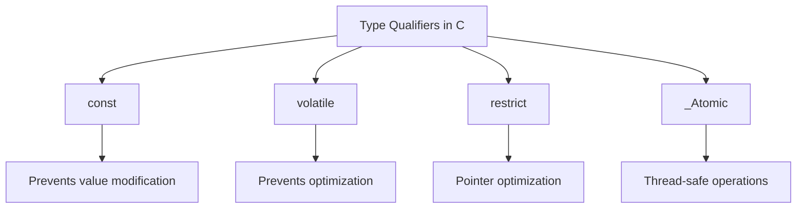

## Tổng quan

Trong lập trình C, type qualifiers là các từ khóa dùng để điều chỉnh hành vi của biến và cách chúng có thể được truy cập hoặc sửa đổi. Chúng đóng vai trò quan trọng trong việc viết mã an toàn và hiệu quả.



## 1. const Qualifier 🔒

The `const` qualifier tells the compiler that a variable's value should not be modified after initialization.

### Different Ways to Use const

```c
// 1. Constant value
const int MAX_SIZE = 100;  // Value cannot be changed

// 2. Pointer to constant data
const int* ptr1;          // Data pointed to cannot be changed
// or
int const* ptr2;          // Same as above

// 3. Constant pointer
int* const ptr3 = &value; // Pointer cannot point to different address

// 4. Constant pointer to constant data
const int* const ptr4;    // Both pointer and data are constant
```

> 💡 **Pro Tip**: Use `const` whenever you want to protect data from accidental modifications.

## 2. volatile Qualifier ⚡

The `volatile` qualifier informs the compiler that a variable's value might change at any time without any action being taken by the code.

### Common Use Cases

```c
// Hardware register
volatile uint32_t* status_register;

// Shared resource in multi-threaded environment
volatile int shared_flag;

// Infinite loop with volatile
volatile int flag = 1;
while(flag) {
    // Flag might be changed by interrupt
}
```

> ⚠️ **Important**: Always use `volatile` for hardware registers and interrupt-accessible variables.

## 3. restrict Qualifier (C99) 🎯

The `restrict` qualifier is used with pointers to tell the compiler that the pointer is the only means of accessing the data it points to.

```c
void process_array(int* restrict ptr1, int* restrict ptr2, int size) {
    // Compiler can optimize knowing ptr1 and ptr2 don't overlap
    for(int i = 0; i < size; i++) {
        ptr1[i] = ptr2[i] * 2;
    }
}
```

## 4. _Atomic Qualifier (C11) ⚛️

Ensures atomic (uninterruptible) access to variables in concurrent programming.

```c
#include <stdatomic.h>

_Atomic int shared_counter = 0;

// This operation is guaranteed to be atomic
shared_counter++;
```

## Best Practices 📝

1. **Use const Liberally**
   - Make all variables that shouldn't change `const`
   - Use const pointers for function parameters that shouldn't be modified

2. **volatile Usage**
   - Use for hardware registers
   - Use for variables shared with interrupts
   - Don't overuse - it prevents optimizations

3. **restrict Guidelines**
   - Use only when you're sure about pointer exclusivity
   - Helpful for optimization in numerical computations

4. **_Atomic Considerations**
   - Use for shared variables in multi-threaded code
   - Consider performance implications

## Common Mistakes to Avoid ❌

1. **const Confusion**
   ```c
   const int* ptr;      // Can't modify data through ptr
   int* const ptr;      // Can't modify ptr itself
   ```

2. **Missing volatile**
   ```c
   // Wrong
   uint32_t* hw_register;
   
   // Correct
   volatile uint32_t* hw_register;
   ```

3. **Incorrect restrict Usage**
   ```c
   // Dangerous if arrays might overlap
   void copy(int* restrict dest, int* restrict src);
   ```

## Summary 🎯

Type qualifiers are powerful tools in C that help you:
- Prevent bugs through `const`
- Handle hardware with `volatile`
- Optimize code with `restrict`
- Manage concurrent access with `_Atomic`

## References 📚

1. C11 Standard - ISO/IEC 9899:2011
2. "C Programming: A Modern Approach" by K.N. King
3. "Expert C Programming" by Peter van der Linden
