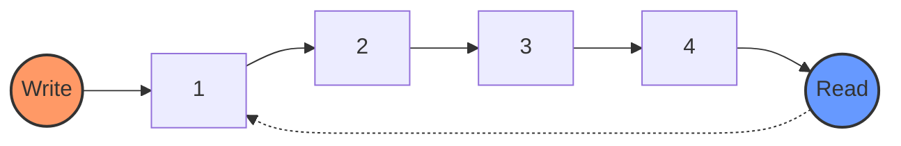

# 🔄 Tìm hiểu thêm về Ring Buffer

## 📝 Ring Buffer là gì?

Ring Buffer là một cấu trúc dữ liệu dạng FIFO (First In First Out) có kích thước cố định, được thiết kế để:
- Lưu trữ dữ liệu tạm thời
- Quản lý bộ nhớ hiệu quả
- Xử lý dữ liệu streaming

## 🎯 Nguyên lý hoạt động



## 💡 Các thành phần chính

1. **Buffer Array** 📦
   - Mảng có kích thước cố định
   - Lưu trữ dữ liệu theo kiểu vòng tròn
   - Thường có kích thước là lũy thừa của 2

2. **Write Pointer** ✍️
   - Chỉ vị trí ghi tiếp theo
   - Di chuyển theo chiều thuận
   - Quay về đầu khi đến cuối

3. **Read Pointer** 👀
   - Chỉ vị trí đọc tiếp theo
   - Theo sau Write Pointer
   - Không vượt quá Write Pointer

## ⚡ Trạng thái Buffer

### 1. Buffer Rỗng
```
Read = Write
[ ][ ][ ][ ][ ][ ]
 ^
R/W
```

### 2. Buffer Đầy
```
(Write + 1) % Size = Read
[1][2][3][4][5][6]
 ^             ^
 R             W
```

### 3. Buffer Đang Sử Dụng
```
[1][2][3][ ][ ][ ]
       ^     ^
       R     W
```

## 🔧 Cài đặt cơ bản

```c
#define BUFFER_SIZE 8

typedef struct {
    uint8_t data[BUFFER_SIZE];
    uint32_t read;
    uint32_t write;
} RingBuffer;

void init(RingBuffer* rb) {
    rb->read = 0;
    rb->write = 0;
}
```

## 🚀 Ứng dụng phổ biến

1. **Nhúng (Embedded)** 🔌
   - UART/Serial Communication
   - ADC Data Collection
   - Sensor Data Buffering

2. **Audio Processing** 🎵
   - Audio Buffering
   - Digital Signal Processing
   - Real-time Audio Streaming

3. **Network** 🌐
   - Packet Buffering
   - Message Queuing
   - Data Streaming

## ⚠️ Lưu ý khi sử dụng

1. **Race Condition** 🏃
   - Cần mutex trong đa luồng
   - Atomic operations
   - Critical section protection

2. **Buffer Overflow** ⚡
   ```c
   if (isFull(rb)) {
       // Xử lý khi buffer đầy
       // 1. Overwrite
       // 2. Drop new data
       // 3. Wait
   }
   ```

3. **Buffer Underflow** 📉
   ```c
   if (isEmpty(rb)) {
       // Xử lý khi buffer rỗng
       return ERROR_BUFFER_EMPTY;
   }
   ```

## 💪 Ví dụ thực tế

### Producer-Consumer Pattern
```c
// Producer
void produce(RingBuffer* rb, uint8_t data) {
    while (isFull(rb)) {
        // Wait or handle full condition
    }
    write(rb, data);
}

// Consumer
uint8_t consume(RingBuffer* rb) {
    while (isEmpty(rb)) {
        // Wait or handle empty condition
    }
    return read(rb);
}
```

## 🎮 Testing và Debug

```c
void debugPrint(RingBuffer* rb) {
    printf("Buffer Status:\n");
    printf("Size: %d\n", BUFFER_SIZE);
    printf("Read: %d\n", rb->read);
    printf("Write: %d\n", rb->write);
    printf("Content: ");
    
    for (int i = 0; i < BUFFER_SIZE; i++) {
        if (i == rb->read) printf("R");
        if (i == rb->write) printf("W");
        printf("[%d]", rb->data[i]);
    }
    printf("\n");
}
```
