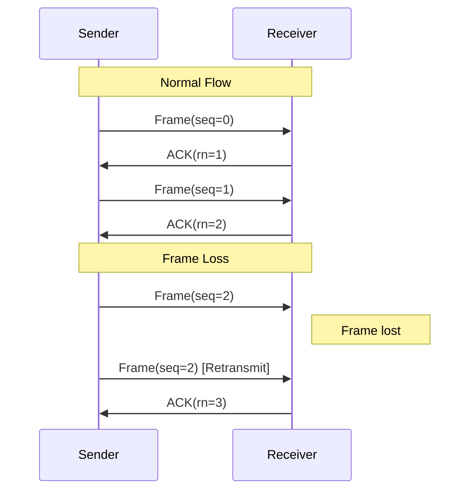
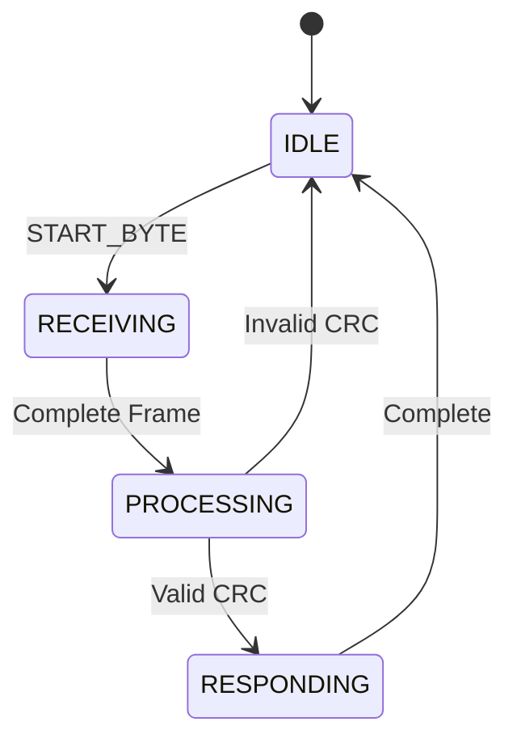

# 📡 MIN Protocol trong Embedded Systems

## 🎯 Tổng quan

MIN (Microcontroller Interconnect Network) là một giao thức nhẹ và đáng tin cậy được thiết kế để trao đổi thông tin giữa vi điều khiển (MCU) và máy chủ. Đặc điểm chính:

- Thiết kế để chạy trên MCU 8-bit nhưng có thể mở rộng cho thiết bị mạnh hơn
- Hỗ trợ khung dữ liệu từ 0-255 bytes

## 🏗️ Kiến trúc Protocol

### 1. Định dạng Khung cơ bản
```
+--------+--------+--------+--------+---------+--------+
| HEADER | ID/CTL |  SEQ   |  LEN  |  DATA   |  CRC   |
+--------+--------+--------+--------+---------+--------+
|  3 AA  | 1 byte | 1 byte | 1 byte| N bytes | 4 bytes|
```

- **Start of frame (SOF)**: 3 bytes
- **Identifier/Control (ID/CTL)**: 1 byte
- **Length**: 1 byte
- **Payload**: up to 255 bytes
- **Checksum**: 4 bytes
- **End of frame (EOF)**: 1 byte

### 2. Loại khung

#### 2.1 Application Frame 📨
- ID từ 0-63 (bit 7 = 0)
- Không đảm bảo gửi tin cậy
- Thích hợp cho dữ liệu không quan trọng

#### 2.2 Transport Frame 🔒
- ID từ 0-63 với bit 7 = 1 
- Có cơ chế gửi lại cho đến khi thành công
- ACK (0xFF) và RESET (0xFE) frames
- Window sliding cho kiểm soát luồng

## � Cài đặt Protocol

### 1. Cấu trúc Context
```c
struct min_context {
    // Transport FIFO queue cho outgoing frames
    struct transport_fifo transport_fifo;
    
    // Buffer và trạng thái nhận
    uint8_t rx_frame_payload_buf[MAX_PAYLOAD];
    uint32_t rx_frame_checksum;
    struct crc32_context rx_checksum;
    uint8_t rx_frame_state;
    uint8_t rx_frame_payload_bytes;
    uint8_t rx_frame_id_control;
    uint8_t rx_frame_seq;
    uint8_t rx_frame_length;
    uint8_t port;
};
```

### 2. Callbacks Required

```c
// Khả năng buffer hiện có cho gửi
uint16_t min_tx_space(uint8_t port);

// Gửi một byte 
void min_tx_byte(uint8_t port, uint8_t byte);

// Thời gian hiện tại (ms)
uint32_t min_time_ms(void);

// Xử lý frame đến
void min_application_handler(uint8_t min_id, 
                           uint8_t *min_payload,
                           uint8_t len_payload, 
                           uint8_t port);
```

### 3. API Functions

```c
// Khởi tạo context
void min_init_context(struct min_context *self, uint8_t port);

// Gửi frame không dùng transport
void min_send_frame(struct min_context *self,
                   uint8_t min_id,
                   uint8_t const *payload,
                   uint8_t payload_len);

// Đưa vào hàng đợi transport 
bool min_queue_frame(struct min_context *self,
                    uint8_t min_id,
                    uint8_t const *payload, 
                    uint8_t payload_len);

// Xử lý bytes nhận được và chạy state machine
void min_poll(struct min_context *self,
             uint8_t const *buf,
             uint32_t buf_len);
```

## 🔄 Transport Protocol (T-MIN)

### 1. Đặc điểm
- Sliding window cho kiểm soát luồng
- Phát hiện và gửi lại frame mất
- Gửi ACK cho frame nhận thành công 
- Có timeout và reset cơ chế

### 2. Cấu hình Transport
```c
// Thời gian timeout
#define TRANSPORT_ACK_RETRANSMIT_TIMEOUT_MS    25
#define TRANSPORT_FRAME_RETRANSMIT_TIMEOUT_MS  50
#define TRANSPORT_IDLE_TIMEOUT_MS              1000

// Kích thước window 
#define TRANSPORT_MAX_WINDOW_SIZE              16
```

### 3. Sequence Diagram



## 🔧 Ví dụ Arduino

```cpp
#include "min.h"

struct min_context min_ctx;

void setup() {
  Serial.begin(250000);
  min_init_context(&min_ctx, 0);
}

void loop() {
  // Đọc bytes từ serial
  char buf[32];
  size_t buf_len = Serial.readBytes(buf, 32);
  
  // Process MIN frames
  min_poll(&min_ctx, (uint8_t *)buf, buf_len);
  
  // Send frame mỗi 1s
  static uint32_t last_sent = 0;
  uint32_t now = millis();
  
  if (now - last_sent > 1000) {
    uint32_t data = millis();
    min_queue_frame(&min_ctx, 0x33, 
                   (uint8_t*)&data, 4);
    last_sent = now;
  }
}

1. **Gửi Command** ⬆️
```c
void sendCommand(uint8_t cmd, uint8_t* data, uint8_t length) {
    MinFrame frame;
    frame.cmd_id = cmd;
    frame.length = length;
    memcpy(frame.data, data, length);
    
    uint8_t buffer[MAX_DATA_SIZE + 4];
    uint16_t frameLength;
    
    packFrame(&frame, buffer, &frameLength);
    UART_Send(buffer, frameLength);
}
```

2. **Nhận và xử lý** ⬇️
```c
void processReceivedByte(uint8_t byte) {
    static uint8_t buffer[MAX_DATA_SIZE + 4];
    static uint16_t index = 0;
    
    switch(index) {
        case 0:  // START byte
            if(byte == START_BYTE) {
                buffer[index++] = byte;
            }
            break;
            
        case 1:  // CMD
        case 2:  // LENGTH
            buffer[index++] = byte;
            break;
            
        default:
            // Handle data and CRC
            buffer[index++] = byte;
            break;
    }
}
```

## ⚠️ Xử lý lỗi phổ biến

1. **CRC không hợp lệ** ❌
   - Kiểm tra CRC mỗi frame
   - Gửi lại nếu CRC sai
   - Log lỗi để debug

2. **Command không hợp lệ** ⚠️
   - Kiểm tra range của command
   - Trả về status lỗi
   - Thông báo cho master

## 📊 State Machine



## 💡 Tips và Tricks

1. **Tối ưu hiệu năng**
   ```c
   // Sử dụng Lookup Table cho CRC
   static const uint8_t crcTable[256] = { ... };
   
   // Macro cho các thao tác thường xuyên
   #define IS_VALID_CMD(cmd) ((cmd) < MAX_CMD_ID)
   ```

2. **Debug hỗ trợ**
   ```c
   void debugPrintFrame(MinFrame* frame) {
       printf("Frame Info:\n");
       printf("CMD: 0x%02X\n", frame->cmd_id);
       printf("LEN: %d\n", frame->length);
       printf("CRC: 0x%02X\n", frame->crc);
   }
   ```

